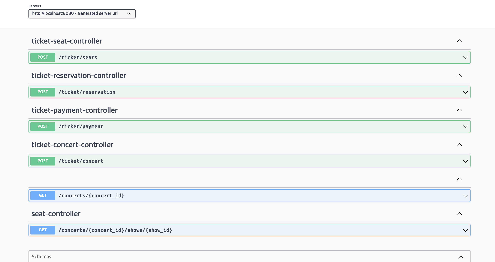
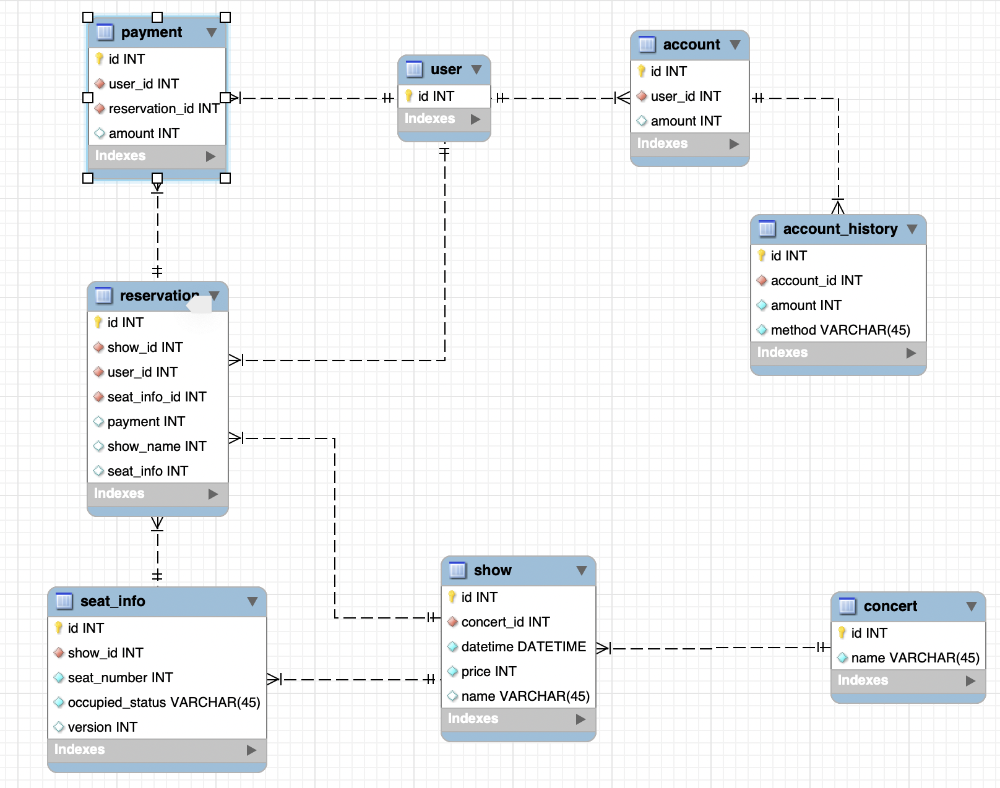

# 콘서트 예약 서비스

## 설계안

https://chip-supernova-606.notion.site/df146619666d472a861b190529608ea6?pvs=4

## API 명세

https://chip-supernova-606.notion.site/API-bb97038b80ce4c989322e4fb0452e900?pvs=4

## ERD screenshot

## 마일스톤

1주차: 설계안 및 API 명세, FakeAPI 작성, ERD 작성, 서버 배포  
2주차: 테스트코드 작성, 토큰 발급 대기열 검증 로직 작성, 예약 가능 날짜/좌석 조회  
3주차: 좌석 예약 요청, 잔액 조회 및 결과조회 API  

## 회고 + 트러블 슈팅

https://chip-supernova-606.notion.site/67b0252bb3bd4b28aa315e647e524b0a?pvs=4

# ci/cd 

## 운영 / 개발 환경 

- develop, prod로 운영

## git flow & github workflow
 
- main -> 
- develop  ->  
- feature/** ->

# 동시성 제어

- 좌석 예약 : 낙관적 락 을 이용하여 동시성 제어. 선점으로 `한 건만 성공`하여도 상관 없으므로 낙관적 락을 이용하였습니다.  
- 금액 충전 및 사용 : 분산 락을 이용하여 비관적인 락과 같은 동작을 기대하여 구현. 비관락을 사용하지 않는 이유는 DB 부하를 줄이기 위함.
참고문서 : https://helloworld.kurly.com/blog/distributed-redisson-lock/

# 인덱스 분석 문서

블로그에 작성: https://ingyeoking13.tistory.com/350

# 대기열 관련 문서

블로그에 작성: https://ingyeoking13.tistory.com/351

# 트랜잭션 분리와 앱 이벤트, 메시지 브로커 

설계안 블로그에 작성: https://ingyeoking13.tistory.com/352

